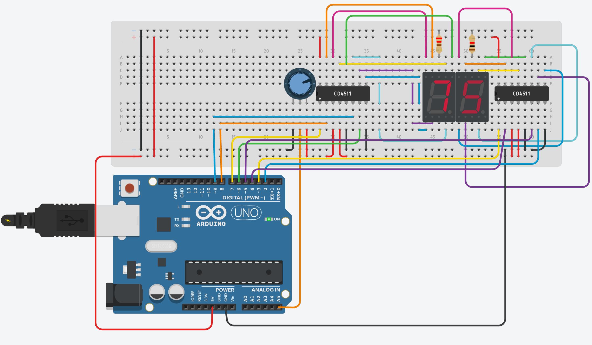

# R3-SoftwareTask1-AbdullahAdib

  For this project I used a potentiometer, two resistors, two CD4511 decoders, two 7 segment displays, Arduino Uno R3. The goal of this project was to read the analog input from the potentiometer that is read as an analog signal. The original number range for the potentiometer is a 10 bit number (0-1023), the map function is used to convert this to a 0 to 99 scale within the Arduino Uno. What happens next is the code splices the 0-99 representation of the signal into ones and tens digits, respectively. Depending on what number is read as the ones and tens digits, 4 digital binary signals are sent to each decoder. The decoder works by taking in n inputs, and then outputting 2n results that are sent to the 7 segment displays. The combination of high's and lows for the binary signals is what makes the matches the mapped value of original potentiometer value. 

[Tinkercad Link](https://www.tinkercad.com/things/eXOkfDUbbnF)
